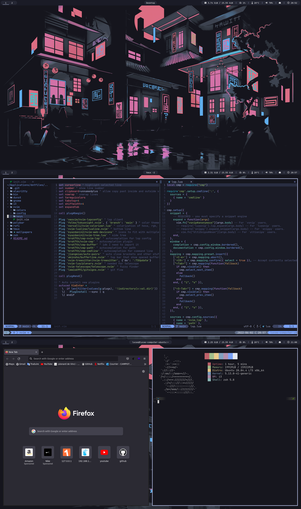

# Dotfiles

Welcome to my dotfiles repository. You can find here all the config files I use on Linux systems.
Feel free to steal anything from here, I also stole some configs ;)
I tried to make an environment that is closest to the colors of the splendid vscode theme [TokyoNight](https://github.com/enkia/tokyo-night-vscode-theme)

## Screenshot


<br>

## Installation

Be sure to have at leat curl installed (and your network can reach internet)

Then you can type :
```bash
curl -fsSL https://redeltaz.github.io/dotfiles/etc/install | bash
```
Everything will be auto installed. If an error appear, you can create an [issue](https://github.com/Redeltaz/dotfiles/issues/new)

## Informations

|   |   |
|---|---|
|**OS**| [Arch](https://archlinux.fr/) |
| **WM** | [i3](https://github.com/i3/i3) |
| **Terminal** | [Alacritty](https://github.com/alacritty/alacritty) |
| **Shell** | [zsh](https://github.com/ohmyzsh/ohmyzsh) |
| **Editor** | [neovim](https://github.com/neovim/neovim) |
| **Status Bar** | [polybar](https://github.com/polybar/polybar) |
| **App Launcher** | [rofi](https://github.com/davatorium/rofi) |
| **Notifications** | [dunst](https://github.com/dunst-project/dunst) |
| **Terminal Multiplexer** | [tmux](https://github.com/tmux/tmux) |
| **Compositor** | [picom](https://github.com/yshui/picom) |
